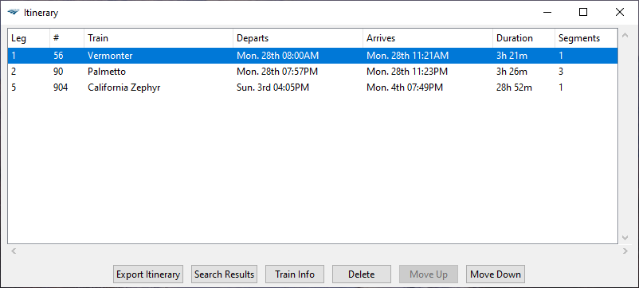

The application interface immediately after opening. You are guided downwards toward the “Find Trains” button, having completed each prerequisite beforehand (origin, destination, departure date).

---

Search functionality in the station list. Press Enter after typing to show available stations.

---

Date selection functionality. Clicking a date, the “Select Departure Date” button, or the date label will close the calendar popup. You may only select a date greater than or equal to the current day.

---

A search has been completed and the results are displayed in the table. The header area has been updated with the search information and the number of trains found. You will be able to click the "Save Segment" button only after a train is highlighted. Left and right arrows navigate through previous searches.

---

Column settings. By checking the appropriate boxes, those selected columns will appear in the results table and the itinerary.

---

The itinerary window. Saved segments appear in this table. "Export Itinerary" is only available after at least one segment is present. The other four buttons are only enabled once a segment is selected.